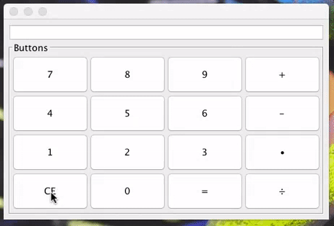

###### Max Omdal ######
###### Code Club 2016 ######

## Calculator Project ##

##### Calculators are used a lot! and in order to make one you need to understand the basics of how graphical user interfaces work #####
- Using the java Swing interface, build a calculator that can be used to calculate basic functions like +,-,÷, and •
- For help on Graphical User Interfaces, check the BigJava/Graphical User Interfaces folder
- The internet is your friend, this project won't be easy
- This project is intentionally more open-ended than most. It is to test how well you can uncover new skills on your own
